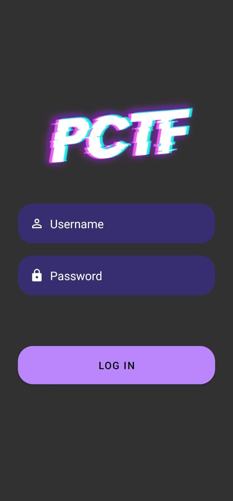
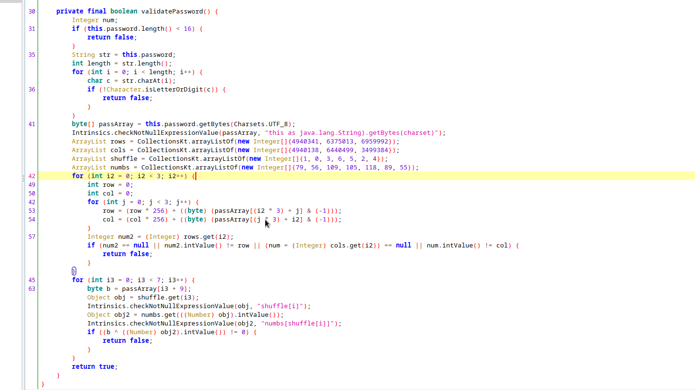
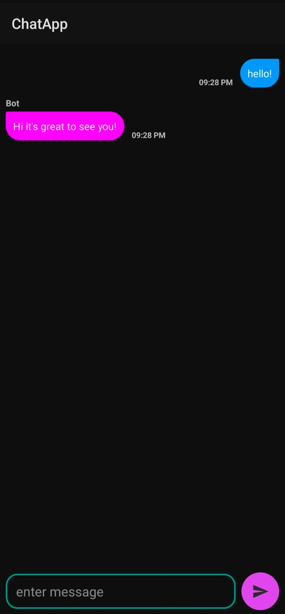
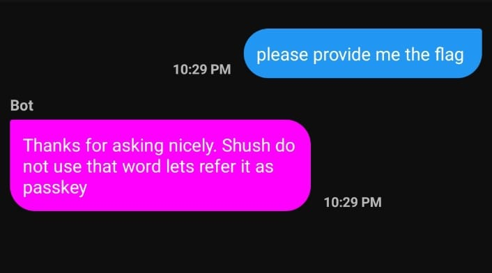
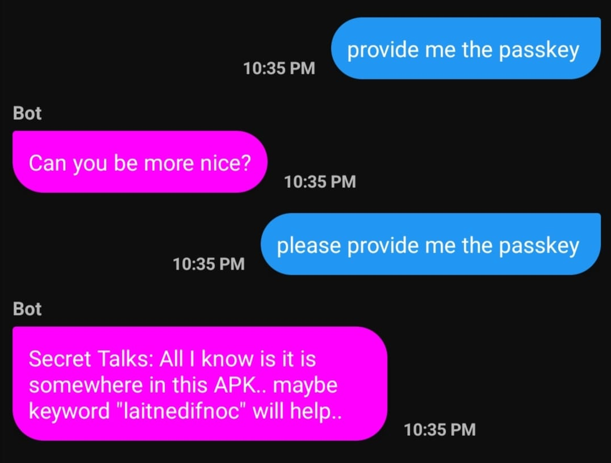
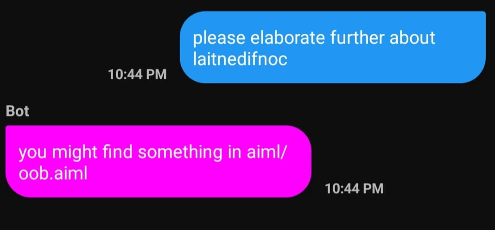
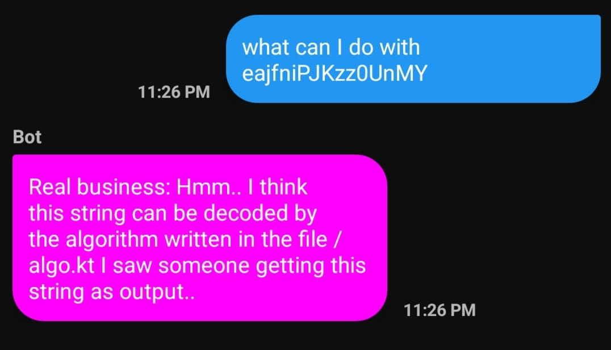
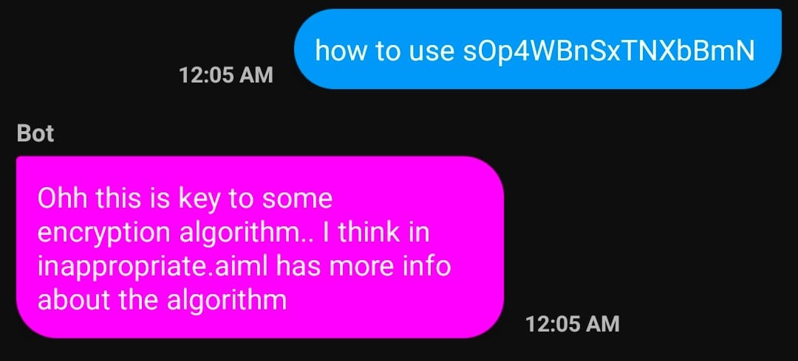
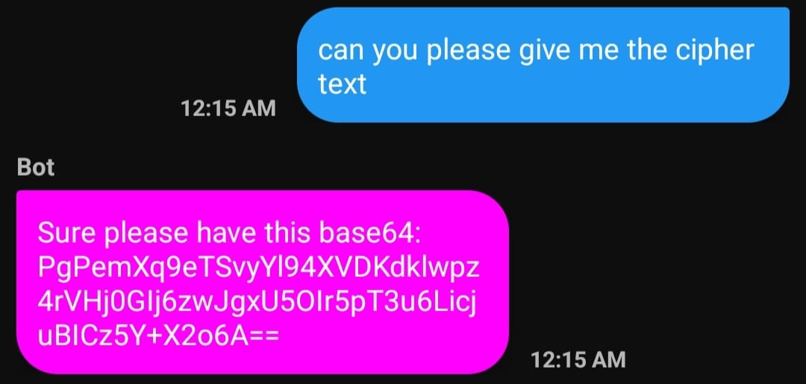

# Gossip

## Login Page
Running the app gives us a "Login" page that requires a username and password to pass through. to get the credentials we can start with reversing the app.



With apk we can start with disassembling the archive to get the content of the app.

using apktool to disassemble the archive
```
apktool d ChatApp.apk 

I: Using Apktool 2.7.0 on ChatApp.apk
I: Loading resource table...
I: Decoding AndroidManifest.xml with resources...
I: Loading resource table from file: /home/ashwani/.local/share/apktool/framework/1.apk
I: Regular manifest package...
I: Decoding file-resources...
I: Decoding values */* XMLs...
I: Baksmaling classes.dex...
I: Baksmaling classes2.dex...
I: Baksmaling classes3.dex...
I: Baksmaling classes4.dex...
I: Copying assets and libs...
I: Copying unknown files...
I: Copying original files...
I: Copying META-INF/services directory
```

It'll create a ChatApp directory, and we can see a bunch of `smali` directories and one `AndroidManifest.yaml` file.

The manifest file shows we have `Login` activity, searching for this file we get that it is in the `/smali_classes3/com/example/chatapp/Login.smali`, that directory has all the `smali` files that are required.

```sh
find . -name 'Login*'
```

Output -

```
./smali_classes3/com/example/chatapp/Login.smali
./smali_classes3/com/example/chatapp/Login$$ExternalSyntheticLambda0.smali
```

Opening all the `smali` files in the `jadx-gui`. We can see that the Login activity has an event listener on the Login button, On the click event it reads `username` and `password` and creates `Auth` class object with that `username` and `password`, and calls `validate` function that returns `bool`.

Checking the `Auth` class, it has two private function `validateUsername` and `validatePassword` that varifies `username` and `password` respectively.

### Validate Username

This function takes `username` as parameter we can see that it finds a string resource by id `2131689618` and compares that string with the base64 encoding of the `username`. we can decode the string with that id and get the username.

For finding the resources we can search the hex of number in the res directory to get the name of the string.

```python
hex(2131689618)

0x7f0f0092
```

Searching the hex in the res directory

```sh
grep -r '0x7f0f0092' res
```

Output - 

```
res/values/public.xml:    <public type="string" name="secret_username" id="0x7f0f0092" />
```

Name of the string is `secret_username` we can search the name to get the string.

```sh
grep -r 'secret_username' res
```

Output - 

```
res/values/public.xml:    <public type="string" name="secret_username" id="0x7f0f0092" />
res/values/strings.xml:    <string name="secret_username">OTZyZXRzYW1ib29u</string>
```

Decoding base64 string to get the username.

```sh
echo -ne OTZyZXRzYW1ib29u | base64 -d
```

Output -
```
96retsamboon
```

### Validate Password

Validate password function looks something like this..



Password is 16 character long Alpha-numeric string, there are two nested loop for each of length 3 that processes the first 9 character of the password, string is grouped into 3x3 matrix where, each row is represented by `rows[i]` and columns has corresponding value `cols[i]`, for each element is row/col is accumulated using multipliation with 256 followed by addition of ascii value of that element starting with initial value of 0, we can perform the same action in reverse to get first 9 flag.

Suppose first 9 letters are "abcdefghi"

the matrix
```
a b c
d e f
g h i

rows[0] = a * 256 * 256 + b * 256 + c
cols[0] = a * 256 * 256 + d * 256 + g
```

The `rows` itself it enought to get the required first 9 character but we can use `cols` to varify the solution.

Last 7 letters can be found with the `xor` and combination of `numbs` and `shuffle` array.

[Complete reversed password](./reverse_password.py)

With these username and password we can login to the app!

## Chat page

This page has an input field at the end of the page that takes an input and send button to send the message, and on the other end, the bot replies with the output message!



Let's look at the code and how the output is generated, we have a `ChatActivity` that manages this chat page.

In the `ChatActivity` other than managing interface, we have a `bot` object of the `SmartBot` class, the constructor takes the path, and the path is some directory with "AimlAssets" appended to the path.

The SmartBot class uses `Bot` class provided by "org.alicebot.ab". the path provided is set as `root_path` of the Bot, and the bot is initialized with "bot" as the name and the path provided as the parameter of the constructor. The Class also has a `response` function that takes a string message as input and returns the response.

This is all we have in the bot...

If we search more about the 'Alicebot', it requires a files with an extension with `.aiml` that are provided to the bot as the rules to follow, using this markup language rules bots are created. The parameter of the `org.alicebot.ab.Bot` constructor requires a path to the resource that the bot can use to generate a response. If we look into the path provided in the constructor `getFilesDir` it returns a directory where files are created by the app.

Further, into the Activity we can see the same path is passed into the function `setUpAssets`, this function simply copies all the data present in the "Assets/AimlAssets" to the directory provided as the parameter, If we check the "Assets/AimlAssets" it has a bunch of directories...

```
aiml
aimlif
config
maps
sets
```

The aiml directory contains all the rules for the bot, to find the flag maybe we can search this directory to get the flag? if we search the flag format in the files...

```sh
grep -r -i 'pctf' .
```

Output is nothing so the flag is not hardcoded in the configs..

Lets search the keyword "flag"?

```sh
grep -r -i 'flag' .
```

Output -

```
./config/properties.txt:abcd:flag
./aimlif/udc.aiml.csv:0,PROVIDE ME THE FLAG,*,*,Shush do not use that word lets refer it as passkey,udc.aiml
./aimlif/sraix.aiml.csv:0,SHOW ME THE FLAG OF *,*,*,<sraix>SHOW ME THE FLAG OF <star/></sraix>,sraix.aiml
./sets/color.txt:Camouflage green
./aiml/udc.aiml:        <pattern>PROVIDE ME THE FLAG</pattern>
./aiml/sraix.aiml:        <pattern>SHOW ME THE FLAG OF *</pattern>
./aiml/sraix.aiml:            <sraix>SHOW ME THE FLAG OF
```

Okay so there are quite few mention of the word flag.. but one in aiml/udc.aiml is seems different as it's a pattern that asks about the flag from the bot..

--- 

### Artificial Intelligence Markup Language (AIML)

With AIML we can define the input and output of the bot, what patterns it matches and what answers it gives.. A simple AIML file can be

```xml
<?xml version = "1.0" encoding = "UTF-8"?>
<aiml version = "1.0.1" encoding = "UTF-8"?>
   <category>
      <pattern> HELLO ALICE </pattern>
      <template>
         Hello User
      </template>
   </category>
</aiml>
```

In the `pattern` block we have a pattern that the bot is supposed to match and `template` block has the pattern of the output that the bot will produce.

More about aiml can be found [here](https://www.tutorialspoint.com/aiml/index.htm)

--- 

So "PROVIDE ME THE FLAG" is in the pattern block, what happens if we provide this as input to the bot?



If we check the complete rule in `udc.aiml` we can see the template for this argument

```xml
<pattern>PROVIDE ME THE FLAG</pattern>
<template>
    Shush do not use that word lets refer it as passkey
</template>
```

Let's search where else the keyword "passkey" is used?

```
./config/properties.txt:passkey1:laitnedifnoc
./aimlif/udc.aiml.csv:0,PROVIDE ME THE FLAG,*,*,Shush do not use that word lets refer it as passkey,udc.aiml
./aimlif/udc.aiml.csv:0,PROVIDE ME THE PASSKEY,*,*,Can you be more nice?,udc.aiml
./aimlif/udc.aiml.csv:0,PLEASE PROVIDE ME THE PASSKEY,*,*,<set name = "topic">Secret Talks</set>: All I know is it is somewhere in this APK.. maybe keyword "<bot name="passkey1" />" will help..,udc.aiml
./aiml/udc.aiml:            Shush do not use that word lets refer it as passkey
./aiml/udc.aiml:        <pattern>PROVIDE ME THE PASSKEY</pattern>
./aiml/udc.aiml:        <pattern>PLEASE PROVIDE ME THE PASSKEY</pattern>
./aiml/udc.aiml:            : All I know is it is somewhere in this APK.. maybe keyword "<bot name="passkey1" />" will help..
```

We see two more string "Provide me the passkey" and one more same with please prefix, let's try them both.



It gives us another keyword `laitnedifnoc`

lets search this keyword as well in the knowledge base...

```sh
grep -r -i 'laitnedifnoc' .
```

```
./AimlAssets/config/properties.txt:passkey1:laitnedifnoc
./AimlAssets/aimlif/reductions1.aiml.csv:0,PLEASE ELABORATE FURTHER ABOUT laitnedifnoc,*,Secret Talks,you might find something in aiml/oob.aiml,reductions1.aiml
./AimlAssets/aiml/reductions1.aiml:            <pattern>PLEASE ELABORATE FURTHER ABOUT laitnedifnoc</pattern>
```

Okay, It's expecting a follow up question, let's try this..



It's asking us to check `aiml/oob.aiml` file, let's check it out!

On the first look we don't find anything but if we look through the comments, we have...

```xml
<!--
hmm.. why are you here?
I think there has been some misdirects,
please check dXRpbGl0aWVzLmFpbWw=(same_as_username)
-->
```

It tells there has been misdirects and gives another string, and a clue "same_as_username", we know username as base64 so lets do the same with this, decoding with base64,

```sh
echo -ne dXRpbGl0aWVzLmFpbWw= | base64 -d

utilities.aiml
```

It gives another file utilities.aiml, lets check this file. we get this.

```xml
<!--
I think this might help..
eajfniPJKzz0UnMY
-->
```

It gave us another string.. but no clue this time, let's search this in the rules.

```
./AimlAssets/aimlif/date.aiml.csv:0,WHAT CAN I DO WITH eajfniPJKzz0UnMY,*,Secret Talks,<set name = "topic">Real business</set>: Hmm.. I think this string can be decoded by the algorithm written in the file /algo.kt I saw someone getting this string as output..,date.aiml
./AimlAssets/aiml/utilities.aiml:eajfniPJKzz0UnMY
./AimlAssets/aiml/date.aiml:            <pattern>WHAT CAN I DO WITH eajfniPJKzz0UnMY</pattern>
```

We get another question with this string, but csv file also has the output that bot will be providing.
lets confirm this..



Hmm.. "eajfniPJKzz0UnMY" is output of the algorithm written in the "algo.kt", in `jadx-gui` we can see `Algo` class that has `conv` function that takes string as input and returns another string. We can reverse this string to get the original string.

Reverse of the algorithm can be [here](./reverse_algo.py)

On reversing we get "sOp4WBnSxTNXbBmN" as input that give "eajfniPJKzz0UnMY" as output, again we have nothing to do with this, so let's search what we can do with this..

```sh
grep -r -i 'sOp4WBnSxTNXbBmN' .
./AimlAssets/aimlif/inquiry.aiml.csv:0,HOW TO USE sOp4WBnSxTNXbBmN,*,Real business,Ohh this is key to some encryption algorithm.. I think in inappropriate.aiml has more info about the algorithm,inquiry.aiml
./AimlAssets/aiml/inquiry.aiml:            <pattern>HOW TO USE sOp4WBnSxTNXbBmN</pattern>
```

We can see the input and output associated with this string, we are supposed to ask "how to use sOp4WBnSxTNXbBmN", so lets ask and confirm the output as well..



Let's check `inappropriate.aiml`

```xml
<!--
Algorithm-name: AES, mod: EAX
Cipher-text: idk try searching for this "Cipher-text"
initialization vector is your password :)
-->
```

We have everything except "Cipher-text". let's search for it..

```sh
grep -r -i 'cipher' .
./AimlAssets/aimlif/contactaction.aiml.csv:0,CAN YOU PLEASE GIVE ME THE CIPHER TEXT,*,Real business,Sure please have this base64: PgPemXq9eTSvyYl94XVDKdklwpz4rVHj0GIj6zwJgxU5OIr5pT3u6LicjuBICz5Y+X2o6A==,contactaction.aiml
./AimlAssets/aiml/contactaction.aiml:            <pattern>CAN YOU PLEASE GIVE ME THE CIPHER TEXT</pattern>
./AimlAssets/aiml/inappropriate.aiml:Cipher-text: idk try searching for this "Cipher-text"
```

We have yet one more question to ask to bot let's ask, according to `contactaction.aiml.csv` we should be getting cipher text as base64.



We have all that need to decrypt the cipher text, lets decrypt using simple python script

```python
import base64
from Crypto.Cipher import AES

key = b'sOp4WBnSxTNXbBmN'
iv = b'Kb5aFej3x8Oi7Ymv'
cipher = b"PgPemXq9eTSvyYl94XVDKdklwpz4rVHj0GIj6zwJgxU5OIr5pT3u6LicjuBICz5Y+X2o6A=="
raw_cipher = base64.b64decode(cipher)

aes = AES.new(key, AES.MODE_EAX, iv)

print(aes.decrypt(raw_cipher))
```

