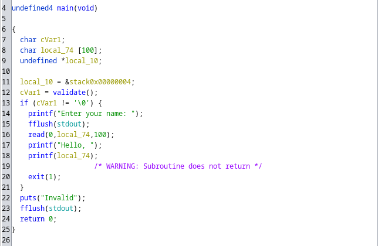
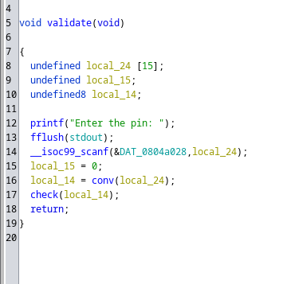
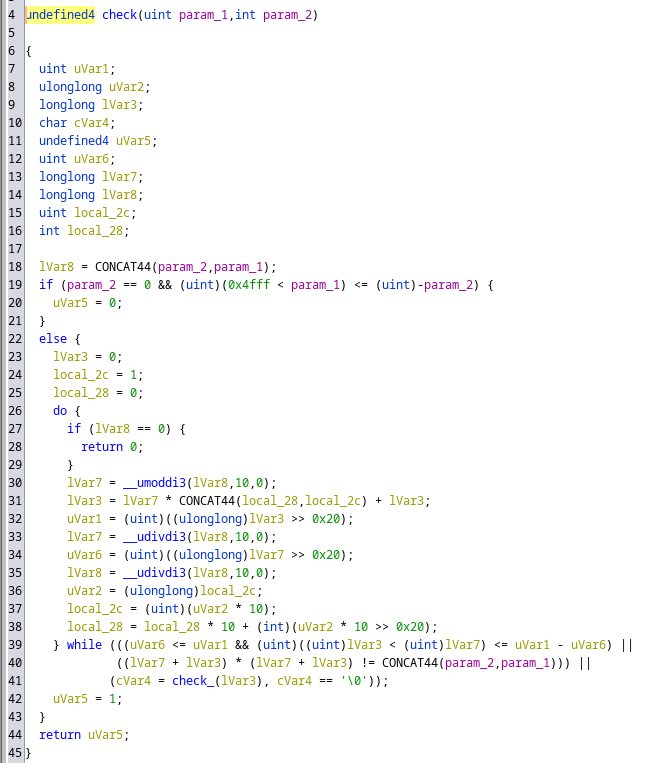

# Lucid

## Analysis
Doing `checksec` on binary shows that there is no `canary`, `PIE` and `Relro` is partial. the partial `Relro` hints at overwriting a GOT entry.

On running the binary, we are asked for the pin and on giving number/string it just exits with an `Invalid` message.

### Checking in Ghidra
With ghidra we see there are user defined functions such as `validate`, `conv`, `check`, `check_`, and `winner`.
`winner` has the logic for getting the flag.

#### main Function


We can see there is call to validate function (which probably asks for pin) and if validate returns non zero(true) value we go to the if block which reads asks for name and stores it in the buffer of size 100, then it simply prints that input simply passing the buffer to the `printf`, this is our exploit, we can read and write stuff to the stack!

#### validate Function


Validate function asks for a pin and stores it in the buffer of size 15, then calls `conv` function on the input, and the output of `conv` function is passed to `check` function. `conv` function converts string input into a integer and returns it if it finds the input wasn't number it simply returns 0. 

#### check Function


`check` function divides the number into two parts left and right, sums up the left and right part and check if the square of the sum is equal to the original number or not, it also passes the right part into the `check_` function, `check_` function returns if the right part is prime or not, it also check if left is greater than right part. this function returns true if the square of the sum of the left and right parts of the number is equal to the original number, the left part is greater than the right part and the right part is prime.

### Reversing the pin
We can start with reversing the pin, which goes through `check` function, we can implement similar things from the `check` function and brute force the number, `check` function rejects if the number is less than 0x5000, we can start from there.

Since dividing the number into two parts summing them up and squaring will give back the original number, we can use this property to optimize the brute force, we know the number will be a perfect square, so instead of searching for the original number, we can brute the square root of the number.

#### [Reversing the pin](./reverse.py)

### Exploiting the printf

We somehow need to call the `winner` function, we have GOT table open to write we can use that, after the last printf call for printing the user input, there is call to exit function, we can override the `exit` entry to the `winner` address.

This will give the plt entry of exit.
```bash
readelf -r ./lucid
```

Output
```txt
 Offset     Info    Type            Sym.Value  Sym. Name
0804c000  00000107 R_386_JUMP_SLOT   00000000   __libc_start_main@GLIBC_2.34
0804c004  00000207 R_386_JUMP_SLOT   00000000   read@GLIBC_2.0
0804c008  00000407 R_386_JUMP_SLOT   00000000   printf@GLIBC_2.0
0804c00c  00000507 R_386_JUMP_SLOT   00000000   fflush@GLIBC_2.0
0804c010  00000607 R_386_JUMP_SLOT   00000000   fgets@GLIBC_2.0
0804c014  00000707 R_386_JUMP_SLOT   00000000   puts@GLIBC_2.0
0804c018  00000907 R_386_JUMP_SLOT   00000000   exit@GLIBC_2.0
0804c01c  00000a07 R_386_JUMP_SLOT   00000000   fprintf@GLIBC_2.0
0804c020  00000b07 R_386_JUMP_SLOT   00000000   fopen@GLIBC_2.1
0804c024  00000d07 R_386_JUMP_SLOT   00000000   __isoc99_scanf@GLIBC_2.7
```

We need to override address 0x0804c018 to the address of `winner`.

winner of address will be can be found easily using.

```bash
objdump -t lucid | grep 'winner'
```

Output:

```bash
080491f6 g     F .text	00000087              winner
```

We run the binary to find where is on the stack the string starts and once we find the starting position we can use a format string to give the address of got entry of the exit and using %n we can override that address.

### [Full exploit](./exploit.py)
