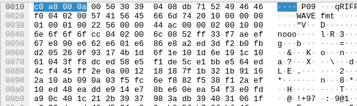
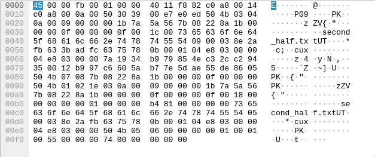

# Nuclearophine

## Observations
On analyzing the pcap file, we see that there are 2 files that are being transferred. We see some TCP packets, followed by a bunch of UDP packets with [WAVE headers](https://docs.fileformat.com/audio/wav/), which is the audio data.



We know this as the TCP convo after that implies that Jesse has heard the audio. This is followed by another packet which has [zip file headers](https://users.cs.jmu.edu/buchhofp/forensics/formats/pkzip.html), which is the encrypted zip file.



Using scapy, we can get the packets that refer to the audio and zip file, get their data and convert them back to their respective files.
```python
from scapy.all import *

# Read the pcap file
packets = rdpcap("chall.pcap")
audio = bytearray()
zip = bytes()

# Get the respective packets
audio_packets = packets[7:137]
zip_packet = packets[139]

# Load Audio Packet data
for packet in audio_packets:
    audio += packet.load

# Write audio to file
with open("corrected/audio.wav", "wb") as f:
    f.write(bytes(audio))

# Making encrypted file
with open("corrected/encrypted.zip", "wb") as f:
    f.write(zip_packet.load)
```
Trying to play the audio file, we see that it is corrupted. Analysing its [headers](https://docs.fileformat.com/audio/wav/), we will see that instead of `data` from bytes `37-40`, we have `nooo`. So we need to change it.

```python
# Load Audio Packet Data ......

# Fix Audio data
audio[36:40] = 'data'.encode('utf-8')

# Write audio to file ....
```
Since the question is talking about hiding something, we can think of LSB steg.

```python
# Extracting first half of password
os.system("stegolsb wavsteg -r -i corrected/audio.wav -o corrected/first_half.txt -n 1 -b 100") # p_ctf{3veryw8ere_1

```

We also have an encrypted zip file which requires a password.

Now, on playing the audio, we can hear a police siren along with what sounds like [DTMF Tones](https://rfmw.em.keysight.com/rfcomms/refdocs/cdma2k/cdma2000_meas_dtmf_desc.html). DTMF Tones are composed mainly of 2 frequencies of high intensity, one from a low range and another from a high range. Looking at the table [here](https://rfmw.em.keysight.com/rfcomms/refdocs/cdma2k/cdma2000_meas_dtmf_desc.html) and analysing each DTMF tone in the wave file, we can figure out which character each of them correspond to.


This gives us `D65B85C1B657DC2BCD54CB89D7C` which is the password. On unzipping, we get a text file having the second half of the flag.
